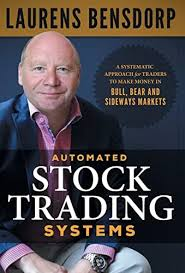

# Automated Stock Trading Systems Implementation

This repository contains Python implementations of systematic trading strategies mentioned in the book **Laurens Bensdorp - Automated Stock Trading Systems_ A Systematic Approach for Traders to Make Money in Bull, Bear and Sideways (2020, Lioncrest Publishing)**
 using the `lumibot` algorithmic trading framework and `pandas_ta` for technical analysis. 


## Overview

This project implements various automated trading systems focusing on different market conditions and strategic approaches. Each system is designed to work independently or as part of a broader portfolio approach.

### Implemented Systems

1. **System 1: Long Trend High Momentum**
To be in trending stocks that have big momentum. This gets you into the high-fliers, the popular stocks, when the market is an uptrend. We only want to trade when the market sentiment is in our favor and we are in very liquid stocks. I like a lot of volume for long-term positions, because the volume may diminish over time and you want to have a cushion so you can always get out with good liquidity.In this system I want the trend of the stock to be up in a very simple way. Nothing fancy. Also, I like to rank this system with the more volatile stocks first.And I want a guaranteed entry—I’m not too worried about slippage because this is a long position, and I’ve calculated some slippage into my backtests anyway. I want to stay in the stock for a long ride up, so I’ll have a wide trailing stop.

2. **System 2: Short RSI Thrust**
Short stocks in order to hedge when the markets move down. When long positions start to lose money, this system should offset those losses. This is the perfect add-on to an LTTF system, to capture those downward moves.

3. **System 3: Long Mean Reversion Selloff**
 This is a long mean reversion system that is built to capture the majority of the pullbacks in an uptrend. We like to buy stocks in an uptrend, because that gives an edge. But if we wait for a pullback, when they become oversold, then the long edge  becomes even greater. Note that while this is a long system, it is conceptually different from Long Trend High Momentum system. Although both systems are trading long, one is holding stocks for an average of over 200 days, while this one is in trades for only a few days, until the stock reverts to its mean. It’s also different from the Short RSI Thrust system, because it’s counting on oversold stocks going up, not stocks going down. When our systems are conceptually different, they take advantage of different market conditions and will not be closely correlated. This, by the way, is a mean reversion system that you can trade in IRA accounts, since it is a long system.

4. **System 4: Long Trend Low Volatility**
System 1, Long Trend High Momentum, was a high volatility system. Conceptually, you don’t want to replicate an existing system, so low volatility is the differentiator here. We already have a system that follows high-volatility stocks, so we’ll look for stocks with lower volatility and a different entry rule. We follow trends, but we will actually have a low correlation with the high-volatility LTTF system.

5. **System 5: Long Mean Reversion High ADX Reversal**
To buy stocks that are in an uptrend, have a significant selloff (which is our buy point), and revert to their mean. This system must be different than Mean Reversion Selloff.

6. **System 6: Short Mean Reversion High Six-Day Surge**
A second mean reversion short system that does not overlap with Short RSI Thrust, seeking profit from overbought stocks. This system might lose money in bull markets but can do very well in sideways and down markets.

7. **System 7: The Catastrophe Hedge**
 A system that sells short when the market shows down momentum that guarantees us being in a short position. It must be a very liquid instrument, and preferably that instrument is replicated by a derivative in case it is not shortable. The key objective for this system is to make money when the market goes down in full momentum.

## Requirements

```
python >= 3.8
lumibot >= 2.0.0
pandas_ta >= 0.3.0
pandas >= 1.3.0
numpy >= 1.20.0
```

## Installation

```bash
git clone https://github.com/Miltiadis-Kon/Automated-Stock-Trading-Systems-in-Python
cd Automated-Stock-Trading-Systems-in-Python
pip install -r requirements.txt
```

## Initialization
At the start of each script you can find this code:

```python
import os
from dotenv import load_dotenv
load_dotenv()
apikey = os.getenv("APCA_API_KEY_PAPER")
apisecret = os.getenv("APCA_API_SECRET_KEY_PAPER")

ALPACA_CONFIG = {
    "API_KEY":apikey,
    "API_SECRET": apisecret,
    "PAPER": True,  # Set to True for paper trading, False for live trading
}
```
To use these strategies on live trading you must set up your API KEY and API SECRET.

See list of **available brokers** and more in depth **guide** on how to set up your keys here:

**https://lumibot.lumiwealth.com/deployment.html#broker-configuration**

## Configuration
At the end of each strategy you can find this code:

```python
def run_live():
        trader = Trader() 
        broker = Alpaca(ALPACA_CONFIG) # SET BROKER
        strategy = LongTrendHighMomentum(broker=broker,
                                         parameters={"Ticker": Asset(symbol="NIO",
                                                                    asset_type=Asset.AssetType.STOCK)
                                                     }
                                        )

        # Run the strategy live
        trader.add_strategy(strategy)
        trader.run_all()

def run_backtest():
        # Define parameters
        backtesting_start = datetime(2023, 10, 23)
        backtesting_end = datetime(2024, 10, 23)
        budget = 10000
        # Run the backtest    
        LongTrendHighMomentum.backtest(
            YahooDataBacktesting, # SET BACKTESTING DATA
            backtesting_start,
            backtesting_end,
            budget=budget, # SET THE BUDGET TO PERFORM BACKTEST ANALYSIS
            parameters={"Ticker": Asset(symbol="NVDA", asset_type=Asset.AssetType.STOCK)}
        )

```
You can swap the **symbol** with whatever is tradable on your broker like this :

```python
def run_live():
        trader = Trader() 
        broker = Alpaca(ALPACA_CONFIG) # SET BROKER
        strategy = LongTrendHighMomentum(broker=broker,
                                         parameters={"Ticker": Asset(symbol="NVDA", # SWAP SYMBOL NAME HERE
                                                                    asset_type=Asset.AssetType.STOCK)
                                                     }
                                        )

        # Run the strategy live
        trader.add_strategy(strategy)
        trader.run_all()
```

## Usage

Each trading system can be run independently or as part of the combined strategy.
At the very bottom of each strategy there is the following code:

```python
if __name__ == "__main__":
    run_backtest()
    #run_live()
```

To execute the backtest you simply run the file. To go live trading change the code to the following:
```python
if __name__ == "__main__":
    #run_backtest()
    run_live()
```

## Order Plotting 
I have implemented a custom code to plot the orders with their rsepctive entry, take profit and stop loss levels. It is not working optimally yet.
To enable / disabe this feature change this parameter 

```python
class SomeStrategy(Strategy):
    
    parameters = {
        "AvgDailyVolume": 50000000,
        "SmaLength":50,
        "Ticker": Asset(symbol="AAPL", asset_type=Asset.AssetType.STOCK),
        "TrailStopLoss" : False, # True if you want to use a trail stop with no tp,
                              #False if you want to use a 2:1 tp:sl ratio
        "RiskRewardRatio" : 2, # Risk Reward Ratio for the trade
        "Plot": False # <-- THIS ONE 
    }
```


## Risk Management

- Implements position sizing based on account risk percentage
- Uses stop-loss and take-profit orders


## Disclaimer

This software is for educational purposes only. Trading financial instruments carries risk. Past performance does not guarantee future results. Users should understand the risks involved and conduct their own analysis before implementing any trading strategy.

## Contributing

1. Fork the repository
2. Create your feature branch (`git checkout -b feature/AmazingFeature`)
3. Commit your changes (`git commit -m 'Add some AmazingFeature'`)
4. Push to the branch (`git push origin feature/AmazingFeature`)
5. Open a Pull Request

## License

This project is licensed under the MIT License - see the LICENSE file for details.

## Further development
I build all strategies for fun as I am experimenting with my own automated trading system.
I might update this repo with strategies from other books as well and further encance them as 
bugs will definately be present.

To keep up with all the updates and newly developed ones you can check out the main repository:
**https://github.com/Miltiadis-Kon/gotti-visualize**